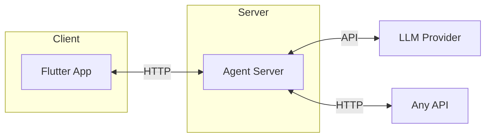

# ApiUI

Chat with any API. Supply an OpenAPI spec, get a conversational interface with built-in visualization.


## What It Does

1. **Point it at an OpenAPI spec** - ApiUI auto-generates LLM tools for every endpoint
2. **Chat naturally** - Ask questions, request data, trigger actions
3. **See results visually** - Charts, images, files, links rendered in the UI

## Quick Start

```bash
# Agent server
cd agent
pip install -e ".[dev]"
uvicorn server:app --reload

# Flutter app (separate terminal)
cd flutter_app
flutter run
```

Set `ANTHROPIC_API_KEY` in your environment.

## Features

- **Auto-generated tools** from OpenAPI specs (JSON/YAML)
- **Rich UI rendering** - markdown, charts, images, file downloads
- **OAuth support** - Google, GitHub, etc.
- **Session persistence** - encrypted tokens, conversation history
- **Meta tools** - bundles large specs (900 endpoints → ~10 tools)

## Supported Specs

Currently: **OpenAPI 3.x** (JSON/YAML)

Coming soon: GraphQL, gRPC, AsyncAPI

## Example

```
You: "What repos does anthropics have on GitHub?"

ApiUI: anthropics has 12 public repositories:
       - claude-code (TypeScript, mass stars)
       - anthropic-sdk-python (Python)
       - courses (Jupyter Notebook)
       [displays as clickable links]

You: "Show stars over time as a line chart"

ApiUI: [renders line chart of star counts]
```

## Configuration

Drop your spec in `agent/specs/` and update `agent/config/agent_config.json`:

```json
{
  "openapi_spec_path": "specs/your-api.yaml",
  "tool_mode": "meta"
}
```

## Architecture



## Docs

- [Specification](docs/SPEC.md)
- [Meta Tools](docs/meta-tools.md)

## License

MIT
